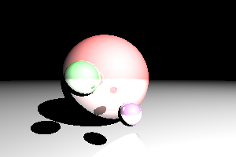
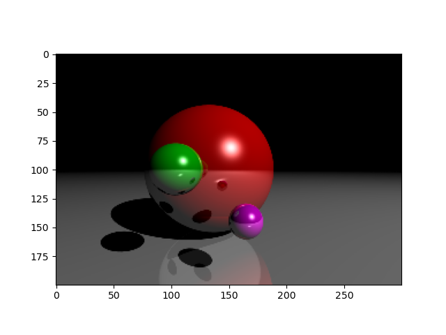

# Quantum Ray Tracer

A research-oriented final project for a college **Quantum Computing** course exploring how
quantum-simulated techniques can be applied to **classical ray tracing** and **Monte Carlo** rendering.

This project compares the aforementioned **classical ray tracing** with **quantum computing** and **quantum supersampling**
approaches using Python and Qiskit.

---

## 📌 Project Overview

Ray tracing is a rendering technique used to simulate realistic lighting by tracing the path of
light rays from the camera through a 2D image plane into a 3D scene. As rays interact with objects,
they may reflect, refract, or cast shadows. These interactions determine the final color of
each pixel.

Since light can undergo many interactions before reaching a light source, ray tracing is
computationally expensive and typically operates on one pixel at a time. To improve realism,
techniques such as Monte Carlo sampling and path tracing are used.

This project investigates whether **quantum supersampling** techniques can reduce noise
and improve image fidelity compared to classical ray tracing, or if an optimal solution with
Monte Carlo techniques would be more efficient.

### Goals
- Implement a classical ray tracer.
- Fix lighting and shading errors in an existing baseline implementation.
- Implement a quantum-simulated ray tracer using **Qiskit**.
- Improve output of a ray tracer with **Monte Carlo's Algorithm** rendering and techniques.
- Compare image quality, noise, and performance tradeoffs.

---

## 🛠️ Installation & Running the Project

### Prerequisites
- Python 3.9+
- [NumPy](https://numpy.org/) (`pip install numpy`)
- [Matplotlib](https://matplotlib.org/) (`pip install matplotlib`)
- [Qiskit](https://qiskit.org/) (`pip install qiskit`)
- Qiskit Aer (`pip install qiskit-aer`)

### Running the Scripts

1. **Clone the repository:**
```bash
git clone https://github.com/huntercademast/QuantumRayTracer.git
cd QuantumRayTracer
```
2. **Run the classical ray tracer:**

python RayTracer.py

3. **Run the quantum ray tracer:**

python QuantumRayTracer.py

4. **Run the Monte Carlo ray tracer:**

python MonteCarloRayTracer.py

5. **View output:**
The scripts display the rendered image using matplotlib.pyplot.
Adjust parameters like num_samples, width, height, or num_qubits in each script to experiment with quality and performance.

---

## 🧠 Key Concepts Explored

- Ray casting and path tracing.
- Monte Carlo's Algorithm.
- Quantum supersampling (QSS).
- Grover’s Algorithm.
- Inverse Quantum Fourier Transform (Inverse QFT).
- Classical vs. quantum-simulated rendering pipelines.
- Noise reduction vs. computational cost tradeoffs.

---

## 🛠️ Technologies Used

- **Python**
- **NumPy**
- **Qiskit**
- Classical Monte Carlo Ray Tracing
- Quantum sampling techniques

---

## 📊 Results & Findings

| Method | Image Fidelity | Render Time |
|------|---------------|-------------|
| Classical Ray Tracing (1 sample) | Low | Fast | 20 Seconds |
| Monte Carlo (10–50 samples) | Medium – High | 11.34 Minutes |
| Quantum Supersampling (10 samples) | Medium – High | 5.6 hours (simulated) |
| Quantum Supersampling (50 samples) | High | 26.41 hours (simulated) |

- Monte Carlo sampling significantly improves shading and reduces pixel artifacts.
- Quantum supersampling further reduces noise and increases the number of error-free pixels.
- QSS is **far slower in simulation**, but theoretically benefits from quantum parallelism.
- Performance limitations are due to **classical simulation of quantum circuits**, not the algorithm itself.

---

## 🖼️ Visual Results

I recommend focusing on the shadows to see the difference, along with the edge of the objects.

### Classical Ray Tracing (Before Fix)


### Classical Ray Tracing (Single Ray per Pixel)
- Sharp edges.
- Poor shading.
- High pixel noise.


### Monte Carlo Sampling
- Smoother shading.
- Reduced noise.
- Improved realism with additional samples.



### Quantum Supersampling (QSS)
- Further noise reduction.
- Cleaner gradients.
- Comparable quality at lower effective sample counts.


Final results were produced using **10 and 50 quantum samples**, with minimal visual difference
between the two.

📊 **Full Presentation:**  
[Quantum Ray Tracer Project Slides (PPTX)](QuantumRayTracerPresentation.pptx)

---

## 🧪 Implementation

- The project initially attempted a dynamic 3D environment similar to early *Doom*-style rendering,
  but this approach proved too complex for adding quantum technology at the time.
- The renderer was converted to a static image pipeline,
- A baseline implementation contained lighting errors caused by incorrect color accumulation
  (multiplication instead of additive illumination), which were fixed.
- Monte Carlo sampling was added to reduce noise and improve shading.
- Quantum supersampling was implemented using:
  - Grover’s Algorithm for amplitude amplification.
  - Inverse Quantum Fourier Transform for phase estimation.
- Pixel color values were estimated from quantum measurement results and mapped back to RGB space.
- Noise introduced by quantum circuit simulation required careful normalization based on sample count.

---

## 🎓 Academic Context

This project was completed as a **final project** for a college-level **Quantum Computing** course
and emphasizes **conceptual and algorithmic comparison**, rather than production-ready
performance.

---

## 📚 References & Sources

**Baseline Code (Classical Ray Tracer)**  
- StackOverflow: [Raytracing in Python](https://stackoverflow.com/questions/75277849/raytracing-in-python)

**Quantum Ray Tracing Papers**  
- Santos, L. P., et al. “Towards Quantum Ray Tracing.” *IEEE Transactions on Visualization and Computer Graphics*, 2024, pp. 1–12. [DOI](https://doi.org/10.1109/tvcg.2024.3386103)  
- Lu, X., Lin, H., “Improved Quantum Supersampling for Quantum Ray Tracing.” *Quantum Information Processing*, vol. 22, no. 10, 2023. [DOI](https://doi.org/10.1007/s11128-023-04114-x)  
- Johnston, E. R., “Quantum Supersampling.” ACM SIGGRAPH 2016 Talks, 2016. [DOI](https://doi.org/10.1145/2897839.2927422)

**Additional References / Community Discussions**  
- Reddit: [Sample per Pixel and Ray per Pixel in Ray and Path Tracing](https://www.reddit.com/r/raytracing/comments/rv1er1/sample_per_pixel_and_ray_per_pixel_in_ray_and/)  
- NVIDIA Developer: [Introduction to Ray Tracing](https://developer.nvidia.com/discover/ray-tracing)

---

## 📫 Contact

**Hunter Mast**  
GitHub: https://github.com/huntercademast  
Email: huntercademast@gmail.com
